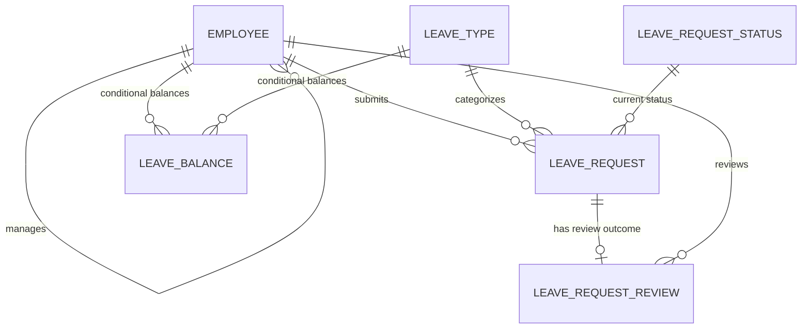

# Entity Relationship Document: Employee Leave Management System

**Project:** Employee Leave Management System

**Version:** 1.0

**Status:** Draft

**Author:** GitHub Copilot

**Last Updated:** 2026-07-09

## 1. Purpose

This document describes the candidate business entities and logical relationships for the Employee Leave Management System based on the current `docs/BRD.md`, `docs/TDD.md`, `docs/DomanModel.md`, and accepted ADRs.

This is not a physical database schema. It does not generate SQL, Oracle DDL, table definitions, indexes, sequences, migrations, seed data, or stored procedures. Candidate primary keys and foreign keys are included only to clarify entity identity and relationships for future database design.

## 2. Source Documents

- `docs/BRD.md`: business requirements, workflow needs, business rules, assumptions, and out-of-scope items.
- `docs/TDD.md`: planned technical direction, database overview, API capability areas, and unresolved technical decisions.
- `docs/DomanModel.md`: candidate entities, Version 1 persistence scope, and deferred items.
- `docs/adr/ADR-001-Oracle26ai.md`: accepted database platform decision.
- `docs/adr/ADR-002-Dapper.md`: accepted database access decision.
- `docs/adr/ADR-003-DotNet10.md`: accepted backend platform decision.
- `docs/adr/AADR-004-Controllers.md`: accepted API implementation style decision.

## 3. Scope and Assumptions

The core logical ERD focuses on entities needed for the initial leave request workflow:

- Employee.
- Leave Type.
- Leave Request Status.
- Leave Request.
- Leave Request Review.

Safe assumptions for this ERD:

- A manager is modeled as an Employee acting in a manager capacity until a future user, role, or organization model is confirmed.
- Employee-to-manager routing is represented as a candidate self-reference on Employee. If future requirements need dated assignments, multiple managers, or assignment history, a separate assignment entity may be introduced.
- Leave Balance is documented as conditional because the current domain model contains conflicting signals: it lists Leave Balance as Version 1 candidate derived data, but later says leave balance records should remain deferred and should not be part of the ERD until requirements are clarified.
- HR or administrative users are not modeled as a separate entity because authentication, authorization, and role storage remain to be decided.
- Candidate keys use logical names only. Final table names, column names, primary key strategy, and Oracle-specific implementation choices remain to be decided.
- Relationship optionality describes business meaning, not final database constraints.

## 4. Candidate Logical ERD

`LEAVE_BALANCE` is shown as conditional. It should not be treated as confirmed physical schema until leave balance rules and the domain model inconsistency are resolved.

## 5. Candidate Entity Catalog

| Entity               | Purpose                  | Candidate PK                   | Candidate FK                                    | Status      |
| -------------------- | ------------------------ | ------------------------------ | ----------------------------------------------- | ----------- |
| Employee             | Leave requester/manager. | `EmployeeId`                   | `ManagerEmployeeId` to Employee.                | V1C         |
| Leave Type           | Leave category.          | `LeaveTypeId`                  | None.                                           | V1C         |
| Leave Request Status | Workflow state.          | `LeaveRequestStatusId`         | None.                                           | V1C         |
| Leave Request        | Leave period request.    | `LeaveRequestId`               | `EmployeeId`; `LeaveTypeId`; `CurrentStatusId`. | V1C         |
| Leave Request Review | Review outcome.          | `LeaveRequestReviewId`         | `LeaveRequestId`; `ReviewerEmployeeId`.         | V1C         |
| Leave Balance        | Available leave.         | `LeaveBalanceId` or composite. | `EmployeeId`; `LeaveTypeId`.                    | Conditional |

`V1C` means Version 1 candidate.

## 6. Relationship Details and Reasoning

### 6.1 Employee to Manager Employee

**Relationship:** One Employee acting as a manager may manage zero or many Employees. One Employee may have zero or one manager employee in the simple candidate model.

**Cardinality:** Employee `1` to Employee `0..many` through `ManagerEmployeeId`.

**Optionality:** Optional from manager Employee to managed Employees; optional from managed Employee to manager Employee until routing rules are confirmed.

**Candidate keys:** `Employee.ManagerEmployeeId` references `Employee.EmployeeId`.

**Reasoning:** The BRD requires employee information, manager information, and a relationship between employees and the managers responsible for reviewing requests. Modeling the manager as another Employee supports that requirement without creating a separate Manager table before role and identity design are confirmed. The optional managed-side relationship leaves room for employees without an assigned manager during setup or before approval routing rules are finalized.

### 6.2 Employee to Leave Request

**Relationship:** One Employee may submit zero or many Leave Requests. Each Leave Request must belong to exactly one Employee.

**Cardinality:** Employee `1` to Leave Request `0..many`.

**Optionality:** Optional from Employee to Leave Request; mandatory from Leave Request to Employee.

**Candidate keys:** `LeaveRequest.EmployeeId` references `Employee.EmployeeId`.

**Reasoning:** The BRD states that employees submit leave requests and that each leave request must be associated with an employee. An employee can exist before submitting any leave request, so the relationship is optional from the employee side and mandatory from the leave request side.

### 6.3 Leave Type to Leave Request

**Relationship:** One Leave Type may categorize zero or many Leave Requests. Each Leave Request must have exactly one Leave Type.

**Cardinality:** Leave Type `1` to Leave Request `0..many`.

**Optionality:** Optional from Leave Type to Leave Request; mandatory from Leave Request to Leave Type.

**Candidate keys:** `LeaveRequest.LeaveTypeId` references `LeaveType.LeaveTypeId`.

**Reasoning:** The BRD requires an employee to identify the type of leave being requested and lists planned leave types such as vacation, sick leave, compensatory, unpaid leave, Casual Leave, Maternity Leave, Paternity Leave, Menstrual Leave, Study Leave, Sabbatical leave. A leave type can exist before it is used, but a leave request cannot be evaluated without a leave category.

### 6.4 Leave Request Status to Leave Request

**Relationship:** One Leave Request Status may be the current status for zero or many Leave Requests. Each Leave Request should have exactly one current status.

**Cardinality:** Leave Request Status `1` to Leave Request `0..many`.

**Optionality:** Optional from Leave Request Status to Leave Request; mandatory from Leave Request to Leave Request Status for the planned workflow.

**Candidate keys:** `LeaveRequest.CurrentStatusId` references `LeaveRequestStatus.LeaveRequestStatusId`.

**Reasoning:** The BRD requires employees to view the current status of submitted requests and says a request should have a status reflecting its workflow position. The TDD also identifies request statuses as planned database data. Storing a current status candidate relationship supports basic workflow visibility while detailed status history remains deferred.

### 6.5 Leave Request to Leave Request Review

**Relationship:** One Leave Request may have zero or one Leave Request Review in the simple initial workflow. Each Leave Request Review must belong to exactly one Leave Request.

**Cardinality:** Leave Request `1` to Leave Request Review `0..1`.

**Optionality:** Optional from Leave Request to Leave Request Review until review occurs; mandatory from Leave Request Review to Leave Request.

**Candidate keys:** `LeaveRequestReview.LeaveRequestId` references `LeaveRequest.LeaveRequestId`.

**Reasoning:** The BRD requires managers to approve or reject leave requests and preserve the review outcome. A newly submitted request has no review yet, so review is optional at creation. The current requirements describe a single manager outcome rather than multiple approval stages, so the candidate relationship is zero-or-one unless approval routing becomes more complex later.

### 6.6 Reviewer Employee to Leave Request Review

**Relationship:** One Employee acting as a manager may perform zero or many Leave Request Reviews. Each Leave Request Review must be performed by exactly one reviewer employee.

**Cardinality:** Employee `1` to Leave Request Review `0..many`.

**Optionality:** Optional from reviewer Employee to Leave Request Review; mandatory from Leave Request Review to reviewer Employee.

**Candidate keys:** `LeaveRequestReview.ReviewerEmployeeId` references `Employee.EmployeeId`.

**Reasoning:** The BRD and TDD require manager review actions and include the business rule that a manager cannot approve their own leave. Referencing Employee for the reviewer supports that rule by allowing application logic to compare the request employee and reviewer employee without needing a separate Manager entity.

### 6.7 Employee and Leave Type to Leave Balance

**Relationship:** One Employee may have zero or many Leave Balances, and one Leave Type may have zero or many Leave Balances. Each Leave Balance must belong to exactly one Employee and exactly one Leave Type if the entity is implemented.

**Cardinality:** Employee `1` to Leave Balance `0..many`; Leave Type `1` to Leave Balance `0..many`.

**Optionality:** Optional from Employee and Leave Type to Leave Balance until balance tracking is confirmed; mandatory from Leave Balance to both Employee and Leave Type if implemented.

**Candidate keys:** `LeaveBalance.EmployeeId` references `Employee.EmployeeId`; `LeaveBalance.LeaveTypeId` references `LeaveType.LeaveTypeId`. A possible candidate uniqueness rule is one balance per employee and leave type.

**Reasoning:** The TDD describes checking leave balance, and the BRD includes planned rules for preventing leave beyond balance and restoring balance after cancellation. However, balance calculation, accrual, restoration, and cancellation behavior remain undecided, and the current domain model is inconsistent about whether Leave Balance belongs in Version 1. For that reason, this relationship is documented as conditional rather than confirmed.

## 7. Many-to-Many Relationships

The core Version 1 candidate model has no confirmed direct many-to-many relationship.

A conditional many-to-many relationship exists between Employee and Leave Type if Leave Balance is implemented. In that case, Leave Balance resolves the relationship because each employee can have balances for multiple leave types, and each leave type can apply to many employees.

Employee and manager routing is modeled as a one-to-many self-reference for now. If future requirements allow multiple managers per employee, dated manager assignments, or approval chains, that relationship should be remodeled through an Employee Manager Assignment entity.

## 8. Deferred or Unconfirmed Entities

| Entity                       | Current Treatment            | Reason                                                                          |
| ---------------------------- | ---------------------------- | ------------------------------------------------------------------------------- |
| User Role                    | Deferred.                    | Authentication, authorization, role storage, and permissions remain undecided.  |
| HR or Administrative User    | Deferred as separate entity. | Current documents define this as a role concept, not a separate identity model. |
| Employee Manager Assignment  | Deferred option.             | Needed only if manager routing needs dates, history, or multiple managers.      |
| Leave Cancellation           | Deferred.                    | Cancellation workflow is not confirmed for Version 1.                           |
| Leave Balance Adjustment     | Deferred.                    | Accrual, restoration, and adjustment rules remain undecided.                    |
| Leave Request Status History | Deferred.                    | Detailed audit and status history requirements are not finalized.               |
| Leave Usage Summary          | Derived/deferred.            | Reporting summaries are outside the initial workflow scope.                     |
| Pending Approval Queue       | Derived/deferred.            | Can likely be derived from requests, statuses, and manager relationships.       |

## 9. Open Decisions Before Physical Schema Design

The following decisions should be resolved before creating Oracle DDL or migration scripts:

- Final primary key strategy and naming convention.
- Final table and column names.
- Whether managers and HR/admin users are roles on Employee, separate user identities, or both.
- Whether manager routing is a simple Employee self-reference or a separate assignment entity.
- Initial set of valid request statuses.
- Whether Leave Request Review is limited to one final outcome or supports multiple review events.
- Whether Leave Balance is part of Version 1 and how balances are calculated, accrued, restored, and adjusted.
- Whether cancellation is part of Version 1.
- Whether status history is required for auditability.
- Audit fields, including created/updated timestamps and actor tracking.
- Oracle-specific implementation choices such as identity generation, sequences, constraints, and indexing.

## 10. Summary

The current logical ERD supports the planned core workflow: employees submit leave requests, requests have leave types and statuses, managers review requests, and review outcomes are preserved.

The most stable Version 1 candidate entities are Employee, Leave Type, Leave Request Status, Leave Request, and Leave Request Review. Leave Balance is documented as conditional because supporting business rules and the current domain model conflict need clarification before physical schema design.
